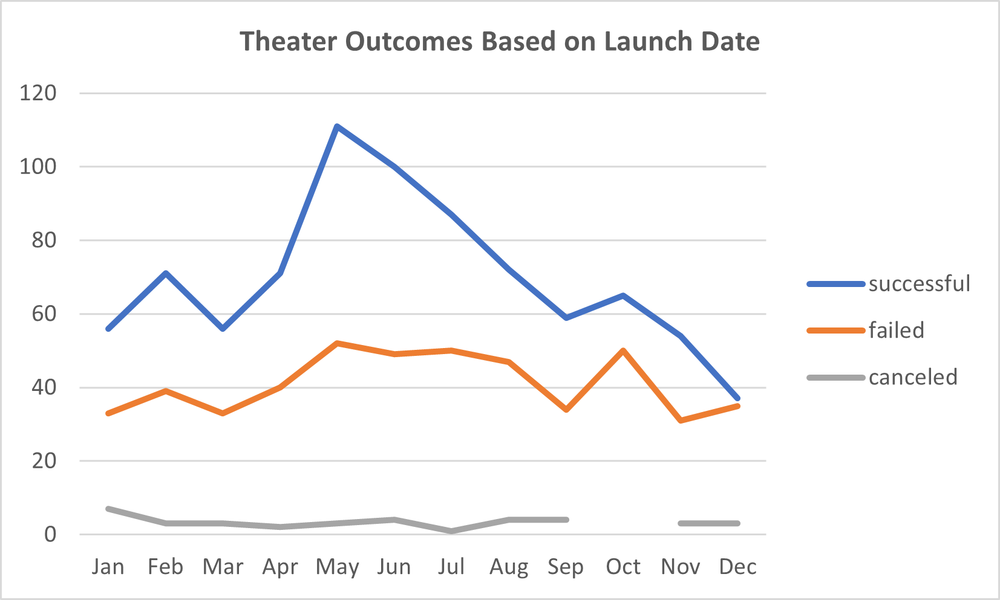
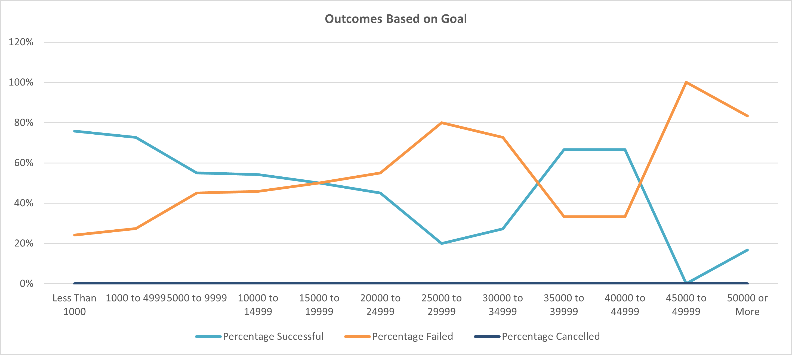

# Analyzing Kickstarters

## Overview
- Using collected statistical data (https://github.com/Jrheldmann/kickstarter-analysis/blob/d7c82470f7879d53e1de5e386f174f44ab6c419a/Kickstarter_Challenge.zip), this project will determine how various kickstarter campaigns fared in relation to their launch dates and funding goals.
### Purpose
- To answer Louise's questions about her competition and prove my competency in Excel
## Analysis and Challenges

### Analysis of Outcomes Based on Launch Date
-To start, I created a "Years" column in the Kickstarter Excel document, wherein I pulled each Kickstarters' Year it was created. This allowed me to then create a pivot table detailing the results of various Kickstarter campaigns by category, year of creation, and result. The pivot table shows that the highest quantity of successful campaigns begin in the month of May, while the least successful campaigns begin in the month of December.

### Analysis of Outcomes Based on Goals
-For the sake of brevity, I used a parcelled the Kickstarter Goal data into rough increments of 5000 dollars and then pulled the exact number of successful, failed, and *cancelled (Note: this word was misspelled in both the provided excel file and the canvas assignment) campaigns. Furthermore, using the total number of projects within those divisions to determine the percentage in which each campaign succeeded, failed, or was cancelled.

### Challenges and Difficulties Encountered
The largest challenge I faced in this project was the sheer amount of irrelevant data and figuring out the processes in which I could filter it down to useful information.
## Results

- What are two conclusions you can draw about the Outcomes based on Launch Date?
  
  *Based on my findings, Louise should start her Kickstarter campaigns in the peak season of May and avoid the month of December as much as possible as it has the highest rate of failure. 

- What can you conclude about the Outcomes based on Goals?
  
  *The cheaper you can set your goals to the better. Louise should set a hard cap of $5000 to all her Kickstarters for optimal chances at meeting their goals, anymore would substantially increase the risk falling in the red.

- What are some limitations of this dataset?

  *A limited sample size. There are a multitude of ways to produce a play beyond Kickstarter. We could be missing a large amount of data. Other crowdfunding services like Indiegogo, donations, investors, advertisements, fundraising events, etc.
- What are some other possible tables and/or graphs that we could create?

  *Possibly a bar graph to determine which countries had to most backers and thus most financially supportive of the arts?
